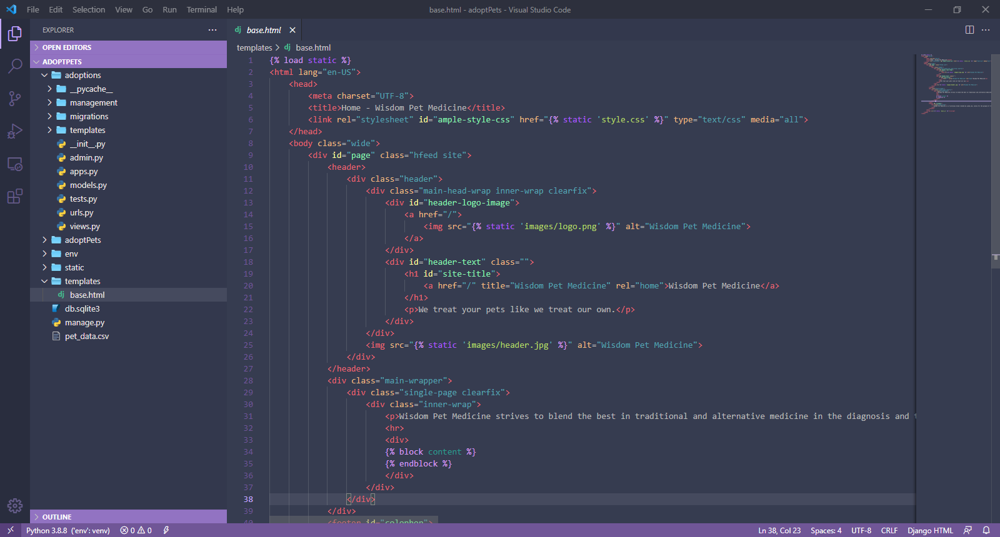
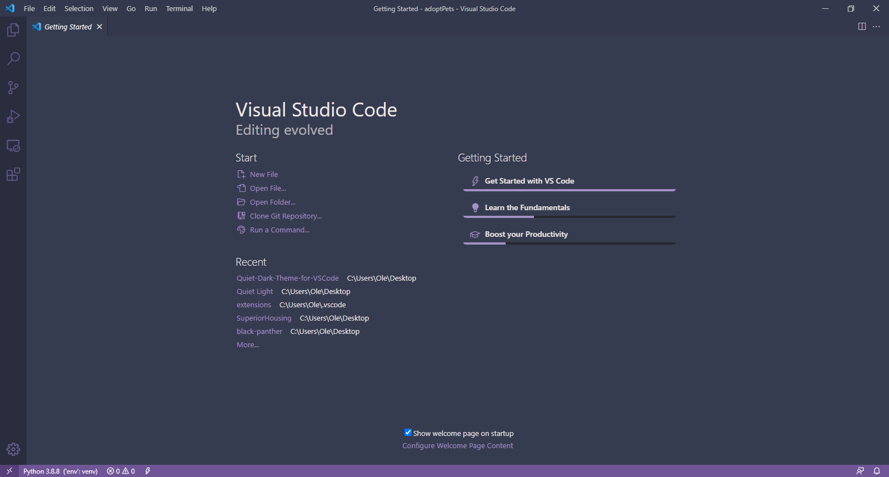

# Quiet Dark Theme for VSCode

Dark Implementation of Visual Studio Code's Quiet Light.

Screenshots!

# Installation

1. Open the **Extensions** sidebar in VS Code. `View → Extensions`
1. Search for `Quiet Dark`, choose "Quiet Dark"
1. Click **Install** to install it
1. Navigate to File > Preferences > Color Theme > **Quiet Dark** (or any of the variants listed)

## Contributing

This project is released under the [MIT License](https://github.com/JGSangara/Quiet-Dark-Theme-for-VSCode/blob/main/LICENSE), contributions are welcomed, find the code [here](https://github.com/JGSangara/Quiet-Dark-Theme-for-VSCode).

## License

This theme is released under the [MIT License](https://github.com/JGSangara/Quiet-Dark-Theme-for-VSCode/blob/main/LICENSE).
