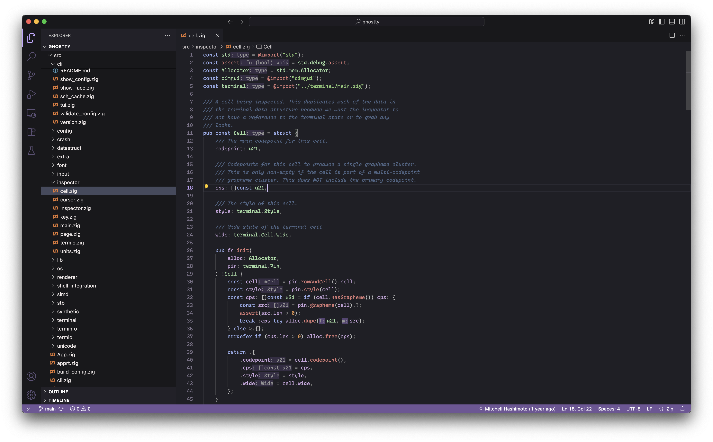

# Quiet Dark Modern Theme for VSCode

Dark implementation of Visual Studio Code's Quiet Light, modernized.

## Screenshots

## Installation

I haven't had the time to package/upload this to the extension marketplace, but you can still install from source.

<!--
1. Open the **Extensions** sidebar in VS Code. `View → Extensions`
2. Search for `Quiet Dark Modern` and choose "Quiet Dark Modern"
3. Click **Install** to install it
4. Navigate to File > Preferences > Color Theme > **Quiet Dark Modern** (or any of the variants listed)
-->

## Credits

Thanks so much to [@JGSangara](https://github.com/JSSangara), who created the original version of this theme [here](https://github.com/JGSangara/Quiet-Dark-Theme-for-VSCode).

## Contributing and licensing

Licensed under the [MIT License](./LICENSE). Contributions are welcome (if any!) at [the repository on GitHub](https://github.com/zabackary/quiet-dark-modern).
